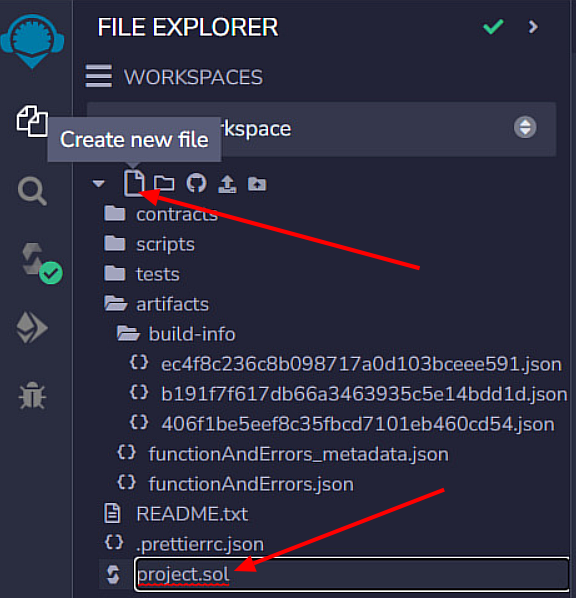
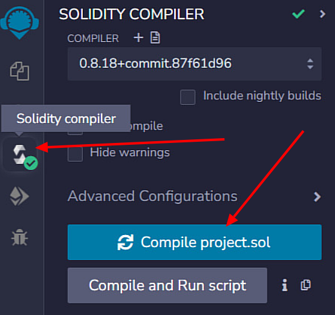
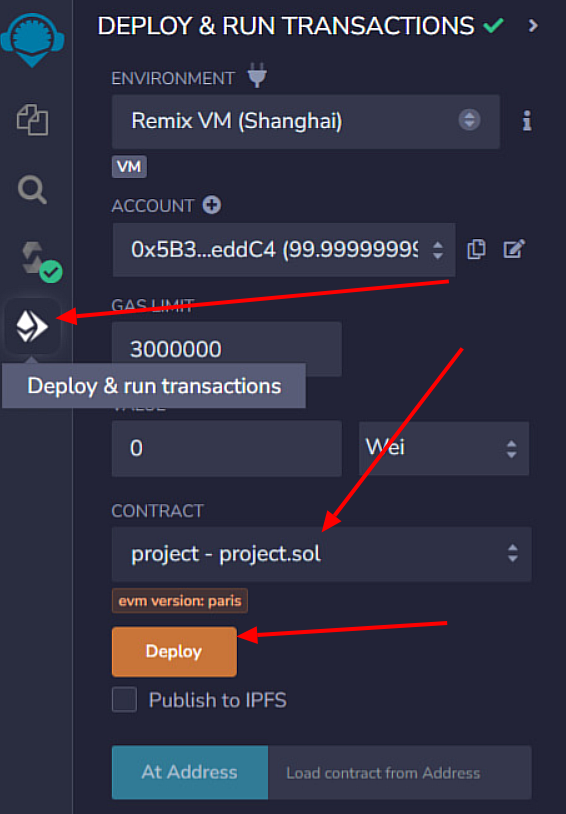
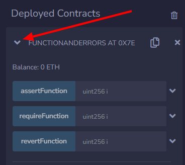

# Functions and Errors

This program is a simple demonstration of how error handling and functions work in a smart contract on the blockchain.

## Description

This is a simple contract written using the Solidity programming language. It showcases a straightforward demonstration of functions and error handling statements inside a smart contract on the blockchain.

It has three functions:

* `requireFunction()` function checks the given condition.
  * If true: It proceeds to the next part of the code/function and returns some value.
  * If false: It prints the optional statement, stops the execution of the function, and rolls back all the changes just before the function was executed.
* `assertFunction()` function checks the given condition.
  * If true: It proceeds to the next part of the code/function and returns some value.
  * If false: It stops the execution of the function and rolls back all the changes just before the function was executed.
* `revertFunction()` function checks the given condition.
  * If true: It proceeds to the next part of the code/function and rolls back all the changes just before the function was executed.
  * If false: It returns some value.

Note: Since, none of the functions are making any changes to the blockchain, I have limited the access of these functions by using the `pure` keyword.

## Getting Started

### Executing program

To run this program, you have to use a Solidity IDE.

* To get started, Open [Remix](https://remix.ethereum.org/ "https://remix.ethereum.org/") an online Solidity IDE.
* Create a new file by clicking on the "+" icon in the left-hand sidebar. Save the file with a .sol extension (e.g., project.sol).



* Copy-paste the code provided below.

  ```solidity
  // SPDX-License-Identifier: MIT
  pragma solidity ^0.8.0;

  contract functionAndErrors {
      function requireFunction(uint i) public pure returns (uint) {
          require(i > 10, "Value is less than 10");

          return i * 10;
      }

      function assertFunction(uint i) public pure returns (uint) {
          assert(i > 10);

          return i * 10;
      }

      function revertFunction(uint i) public pure returns (uint) {
          if (i < 10) {
              revert("Value is less than 10");
          } else {
              return i * 10;
          }
      }
  }
  ```
* To compile the code, click on the "Solidity Compiler" tab in the left-hand sidebar. Make sure the "Compiler" option is set to "0.8.4" (or another compatible version), and then click on the "Compile project.sol" button.



* After successful compilation of code, you can deploy the contract by clicking on the "Deploy & Run Transactions" tab in the left-hand sidebar. Select the "project" contract from the dropdown menu, and then click on the "Deploy" button.



* Once the contract is deployed, you can interact with it by calling its various functions and state variables.



## Authors

[Aayush Yash](https://www.linkedin.com/in/aayush-yash "www.linkedin.com/in/aayush-yash")

## Additional

[Link](https://github.com/Aayushyaash/Metacrafters-Summer-Training "https://github.com/Aayushyaash/Metacrafters-Summer-Training") to my Metacrafters summer training repository.

[Link](https://www.loom.com/share/a9f12f1b8ecf479284a0fe6a9faeb8aa?sid=78021028-d10d-4d50-ad4b-52d320606ad1 "https://www.loom.com/share/a9f12f1b8ecf479284a0fe6a9faeb8aa?sid=78021028-d10d-4d50-ad4b-52d320606ad1") to my video explanation.

## License

This project is licensed under the MIT License - see the LICENSE.md file for details
