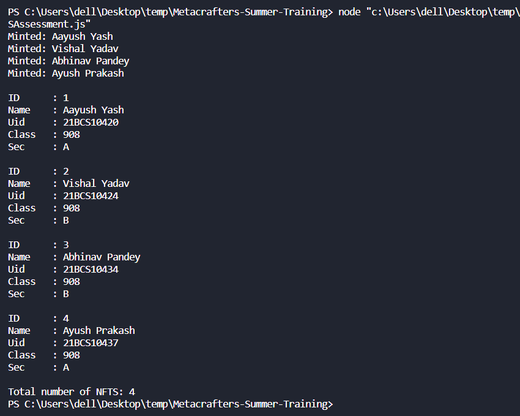

### Project: Create a NFT Collection

#### Source code / Solution

Array to hold the nfts.

```javascript
const nfts=[];
```

mintNFT() function will store the necessary parameters inside nft (object) and then insert it in nfts (array).

```javascript
function mintNFT(iname, iuid, iclass, isec) {
    const nft = {
        name: iname,
        uid: iuid,
        class: iclass,
        sec: isec
    }
    nfts.push(nft);
    console.log("Minted: " + iname);
}
```

listNFT() function will iterate through nfts (array) and print the necessary details on the console.

```javascript
function listNFTs() {
    for (let i = 0; i < nfts.length; i++) {
        console.log("\nID\t: " + (i + 1));
        console.log("Name\t: " + nfts[i].name);
        console.log("Uid\t: " + nfts[i].uid);
        console.log("Class\t: " + nfts[i].class);
        console.log("Sec\t: " + nfts[i].sec);
    }
}
```

getTotalSupply() function will give the total length of the nfts (array).

```javascript
function getTotalSupply() {
    console.log("\nTotal number of NFTS: " + nfts.length);
}
```

Calling all the necessary functions.

```javascript
mintNFT("Aayush Yash", "21BCS10420", "908", "A");
mintNFT("Vishal Yadav", "21BCS10424", "908", "B");
mintNFT("Abhinav Pandey", "21BCS10434", "908", "B");
mintNFT("Ayush Prakash", "21BCS10437", "908", "A");
listNFTs();
getTotalSupply();
```

#### Output


